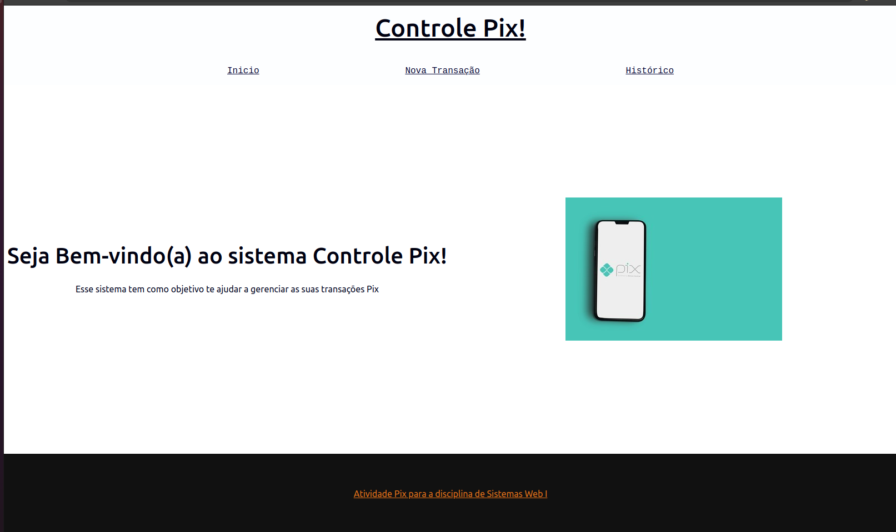
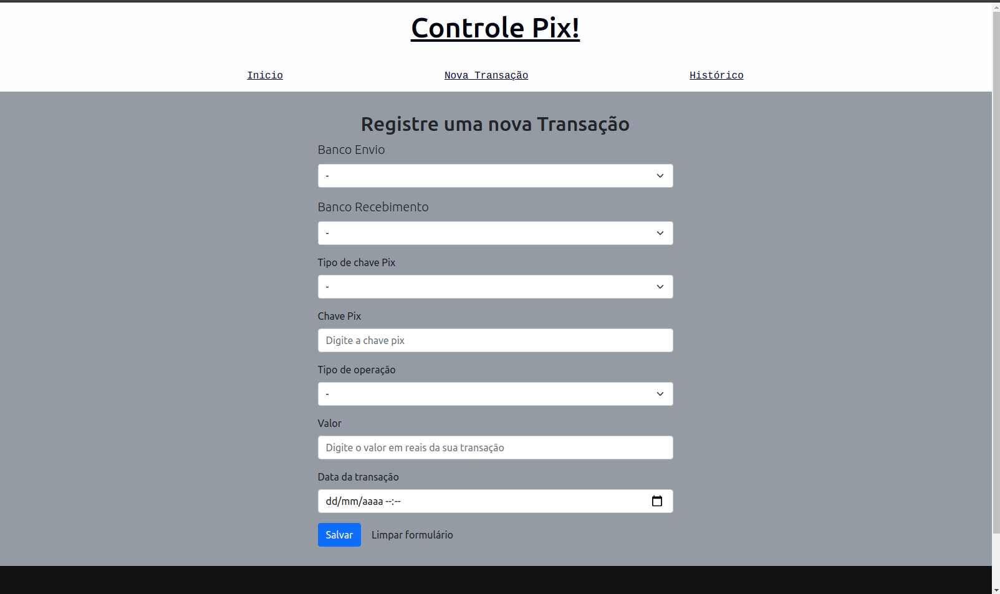
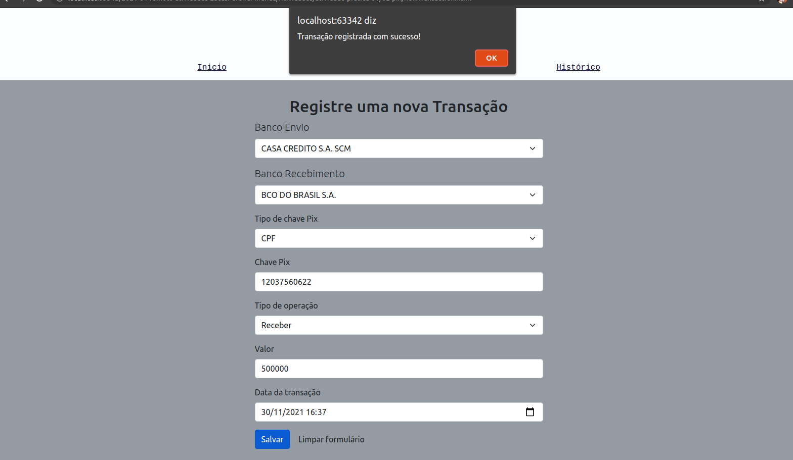
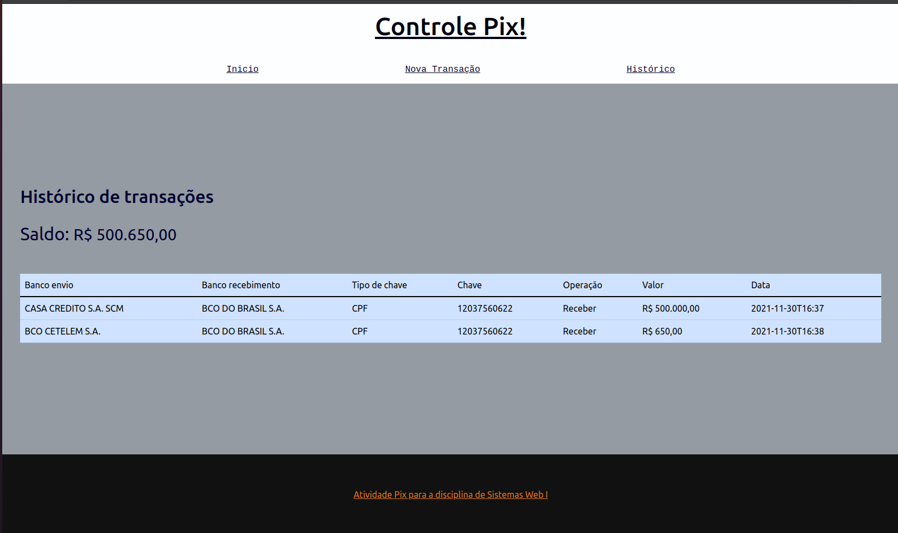

# Controle de Pix

<h1 align="center">
   
  Pix Control
</h1>

  

  
  
  

  

  

 

## 💻 Descrição do projeto

Projeto de um sistema de controle de pix desenvolvido como um dos projetos da atividade prática de sistemas Web I cursado na UFOP em 2021/01.
O projeto utiliza o local storage do navegador para manter informações temporariamente sobre as transações.

## 🚀 Techs

O projeto do sistema de controle de pix foi construído com as seguintes tecnologias

- [HTML](https://developer.mozilla.org/en-US/docs/Web/HTML)
- [CSS](https://developer.mozilla.org/en-US/docs/Web/CSS)
- [Javascript](https://developer.mozilla.org/en-US/docs/Web/JavaScript)

## 💻 Imagens do projeto em execução

### Página de registro de transações:

### Transação registrada com sucesso:

### Saldo total e histórico de transações:

### 💻 Referências:

Aquivo de Reset css utilizado:

- http://meyerweb.com/eric/tools/css/reset/
  v2.0 | 20110126
  License: none (public domain)
